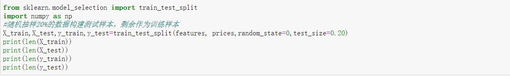

# Machine Learning Engineer Nanodegree
# Model Evaluation and Validation
## Project: Predicting Boston Housing Prices

### Install

This project requires **Python** and the following Python libraries installed:

- [NumPy](http://www.numpy.org/)
- [Pandas](http://pandas.pydata.org/)
- [matplotlib](http://matplotlib.org/)
- [scikit-learn](http://scikit-learn.org/stable/)

### Introduction

The dataset for this project originates from the UCI Machine Learning Repository. The Boston housing data was collected in 1978 and each of the 506 entries represent aggregated data about 14 features for homes from various suburbs in Boston, Massachusetts. For the purposes of this project, the following preoprocessing steps have been made to the dataset:

- 16 data points have an 'MDEV' value of 50.0. These data points likely contain missing or censored values and have been removed.
- 1 data point has an 'RM' value of 8.78. This data point can be considered an outlier and has been removed.
- The features 'RM', 'LSTAT', 'PTRATIO', and 'MDEV' are essential. The remaining non-relevant features have been excluded.
- The feature 'MDEV' has been multiplicatively scaled to account for 35 years of market inflation.

### Feature Observation:

The following behavioral trends are expected from the data:

- RM : The prices increase with increase in the average number of rooms among homes in the neighborhood. Larger homes have higher prices.
- LSTAT : Lower the LSTAT, higher should be the prices in the neighborhood ie. a lower LTSAT indicates people with higher incomes in the neighborhood as compared to others. More affluent families tend to have more expensive homes.
- PTRATIO : Lower the studentt teacher ratio, higher the quality of education and therefore, the neighborhood would be more sought after and have a higher price.

### Target Observation:

- MEDV：The median price of a house

### Code

Step 1. Import the data

Step 2. Data analysis

- Find and view the data

Step 3.Split training set and test set

Step 4.Standardize

Step 5.
House price prediction is a regression problem. To determine the degree of fitting between the predicted value of the model and the actual value, the **R2** score can be used for evaluation.

Step 6.Construct the model

- LinearRegressor

- SGDRegressor

- GradientBoostingRegressor

Step 7.Output result

Step 8.Drawing

### Run
- LinearRegressor：0.6574622113312862

- SGDRegressor：0.6573668659921973

- GradientBoostingRegressor：0.8077756917279131

### My thoughts
The Boston house price forecast is a classic regression model. After calculating various values of housing prices, we found that the housing price data varied so much that it needed to be standardized. The data set is divided into training set and test set, I chose three regression model to forecast the target data, found GradientBoostingRegressor model to predict the most accurate.

